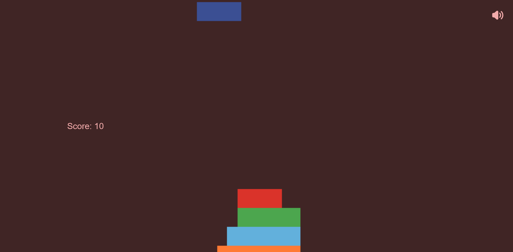
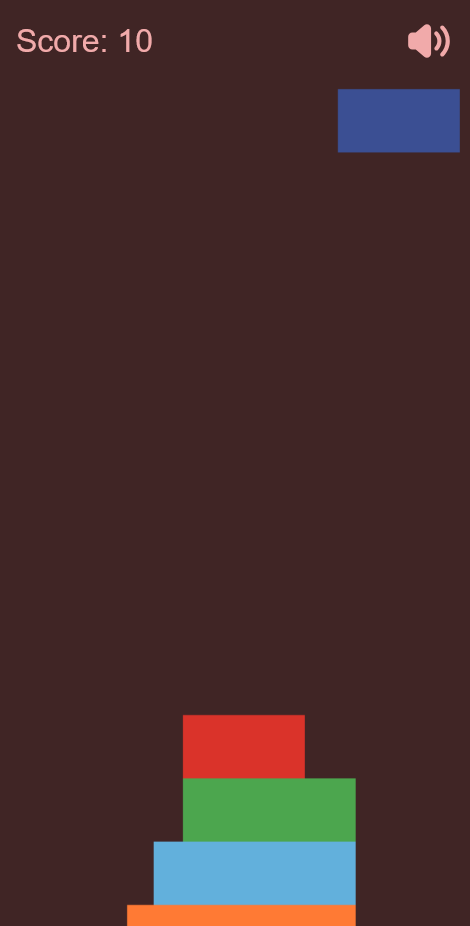

# 🎮 Stack Tower

**Stack Tower** es un sencillo y divertido juego de navegador que consiste en apilar bloques lo más alto posible. El jugador debe hacer coincidir los bloques en movimiento para formar una torre. Si el jugador no coloca el bloque correctamente, el exceso se eliminará, y el bloque restante se hará más pequeño. El objetivo es lograr la torre más alta posible.

Puedes jugar a **Stack Tower** directamente desde este enlace: [Jugar Stack Tower](https://ivan2porta.github.io/StackTower/)

## ✨ Características

- **Animaciones suaves**: los bloques se mueven de un lado a otro, y cuando se colocan correctamente, la torre crece.
- **🔊 Efectos de sonido**: el juego incluye efectos de sonido para mejorar la experiencia del usuario.
- **🔇 Opción de silenciar sonido**: los usuarios pueden activar o desactivar el sonido con un botón dedicado.
- **📱 Soporte responsivo**: el juego está diseñado tanto para pantallas de escritorio como móviles, y ajusta su interfaz automáticamente.

## 🖼️ Capturas del Juego

### 💻 Vista de Escritorio:

  

### 📱 Vista Móvil:

  

## 🎮 Controles del Juego

- **Teclado (Espacio)**: presiona la tecla espacio para soltar el bloque cuando esté alineado con los anteriores.
- **Click del mouse**: puedes hacer click en cualquier parte de la pantalla para soltar el bloque.

## 🚀 ¿Cómo jugar?

1. Los bloques comienzan a moverse de un lado a otro en la parte superior de la pantalla.
2. El jugador debe intentar apilar el bloque en la torre existente haciendo click o presionando la barra espaciadora.
3. Si el bloque no está alineado con el de abajo, el exceso se recorta.
4. Cuanto más alta sea la torre, mayor será la dificultad.
5. El juego termina cuando no queda espacio suficiente para apilar más bloques.

## 🔊 Efectos de Sonido

El juego tiene efectos de sonido para acompañar cada acción (como soltar bloques o cuando el juego termina). Estos efectos de sonido se pueden activar o desactivar con los botones de volumen, tanto en la versión de escritorio como en la móvil.

### 🎶 Botones de sonido:

- **Silenciar**: Al hacer click en el botón de silencio, el sonido se desactiva y el botón cambia a la opción de activar sonido.
- **Activar Sonido**: Puedes volver a activar el sonido haciendo click en el botón correspondiente.

